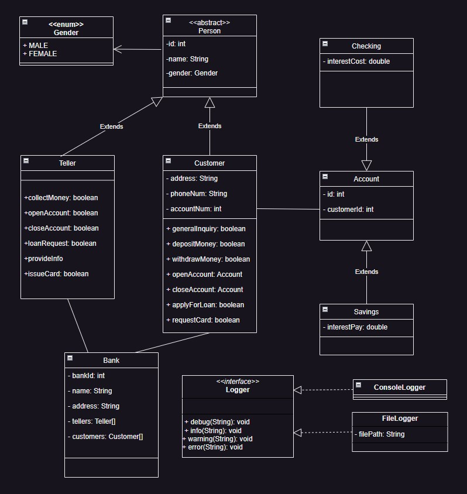

# Java Code Generator

<div style="display: inline-block">
    
    
    
    
    
</div>

### Generate Java code from [draw.io](https://draw.io/) UML class diagrams

<div style="display: inline-block">
    
</div>

### check examples/ folder for output of style tree, syntax tree and code for the above diagram

## Fork information
This fork adds a Typescript generator, whoms syntax is slightly different and which can then be transpiled to javascript.  
The work on getters and setters ahs been stripped in the TypeScript part.

## Setup
````bash
# if pipenv is not installed :
pip install --user pipenv

# Install dependencies
python -m pipenv install

# Install missing deps & codecs
pip install BeautifulSoup4
pip install lxml

````

## Usage
Run the example :
````bash
# Compiles the diagram to both Java an Typescript code
python3 main.py
````

## State
The implementation is very minimal and not all UML Class Diagram syntax is parsed.  
Meanwhile, basic class structures are greatly generated and this script provides a quick starting point for implementing a diagram.  
Think semi-automatic.
