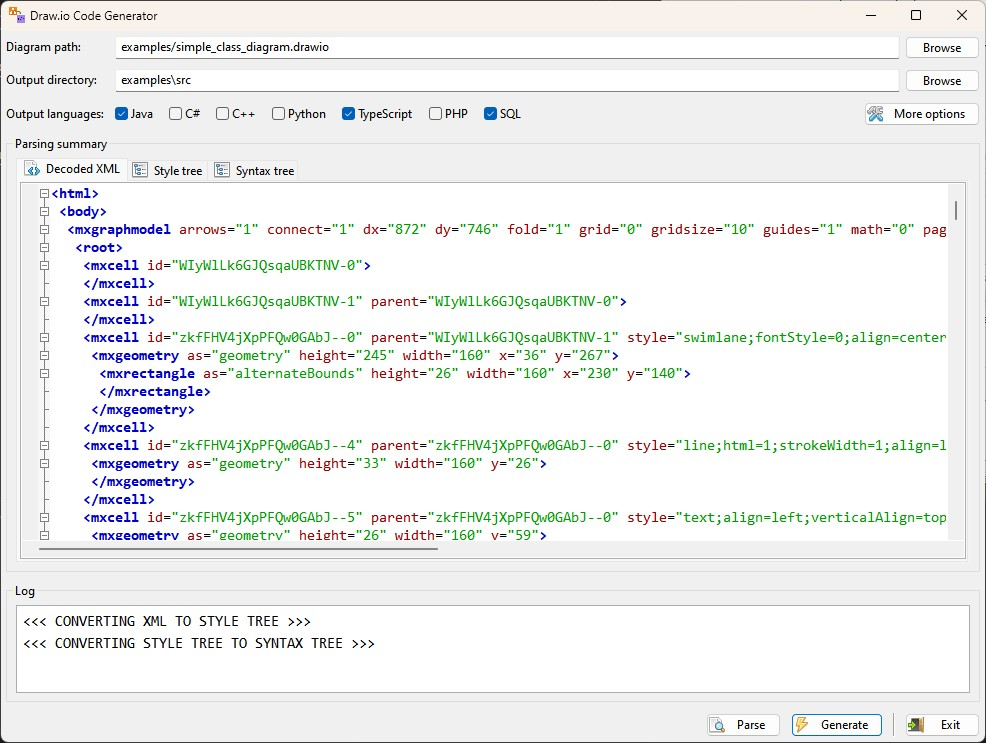
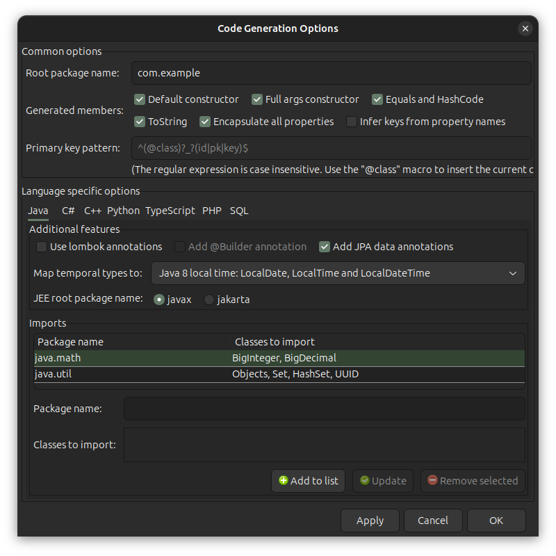

# Draw.io Code Generator

<div>
    
    
    
    
    
</div>

### Generate source code in various programming languages from a [draw.io](https://draw.io/) UML class diagram

Supported target languages are: Java, C#, C++, Python, TypeScript, PHP and SQL.

<div>
    
</div>

## About this fork

This is a fork of the https://github.com/Daandelange/DrawioCodeGenerator repository.<br>
It brings the following noticeable improvements:

1. A [wxPython](https://wxpython.org/) based GUI for an enhanced user experience.
2. The original Java and TypeScript code generators were extended with new functionalities. 
3. New code generators were added for C#, C++, Python, PHP and SQL with the same level of functionalities than the initial ones.
4. The generated xml and json documents are no more stored in files but displayed on the GUI.
5. Abstract classes can either be identified by a name in italics or by an **\<\<abstract\>\>** stereotype besides their name.
6. The **\<\<enum\>\>** and **\<\<enumeration\>\>** stereotypes indicate that a class is in fact an enumeration.
7. A default value can be defined for a property if the property's definition ends with a _" = default_value"_ string, which is very practical for enumeration's members.
8. Class attributes can also have constraints attached to them. Those constraints should be listed between curved braces to the right of the attribute's definition. **e.g.**: `-customer_id: int {id}` or `+getTotalCount(): int {static}`. The recognized constraints are listed in one of the tables bellow
9. Code generators can produce a **package** or **namespace** directive if required. They will also automatically generate an **import**<br>(**using** or **#include** or **require_once**) directive for any symbol that the class being generated depends on.
10. Users can define additional module and/or symbols to import in their class headers through a configuration dialog.
11. If required code generators can also produce other members like accessors (in the form of encapsulated properties or getter/setter pairs), a default constructor, a fully parameterized constructor and overrides for the _equals_, _hashCode_ and _toString_ methods in languages that support those features.
12. Each code generator supports a set of specific options (like using _Lombok_ and/or _JPA_ annotations for the Java code generator or specifying a SQL dialect for the SQL code generator).
13. The program recognizes a set of pseudo data types that can be mapped to equivalent data types in each of the target languages. They are listed in one of the tables bellow.

## Recognized symbols

### 1: Pseudo-data types

|Pseudo-type|Java equivalent|C# equivalent|C++ equivalent|TypeScript equivalent|SQL equivalent|
|-|-|-|-|-|-|
|boolean, bool|boolean|bool|bool|boolean|smallint/tinyint/bit|
|char|char|char|char|string|character(1)|
|wchar|char|char|wchar_t|string|national character(1)|
|sbyte, int8|byte|sbyte|signed char|number|smallint/tinyint|
|byte, uint8|byte|byte|unsigned char|number|smallint/tinyint|
|short, int16|short|short|short|number|smallint|
|ushort, uint16|short|ushort|unsigned short|number|smallint|
|integer, int, int32|int|int|int|number|integer|
|uint, uint32|int|uint|unsigned int|number|integer|
|long, int64|long|long|long long|number|bigint|
|ulong, uint64|long|ulong|unsigned long long|number|bigint|
|foat, single|float|float|float|number|real/float|
|double|double|double|double|number|float/double precision|
|bigint|BigInteger|BigInteger|long long<br>(boost::multiprecision::cpp_int with **boost** enabled)|bigint|decimal(30)|
|decimal|BigDecimal|decimal|long double<br>(boost::multiprecision::cpp_dec_float_50 with **boost** enabled)|number|decimal(30, 10)|
|string|String|string|std::string|string|varchar(2000)|
|wstring|String|string|std::wstring|string|nvarchar(2000)|
|date|LocalDate|DateTime|time_t<br>(boost::gregorian::date with **boost** enabled)|Date|date|
|time|LocalTime|DateTime|time_t<br>(boost::posix_time::time_duration with **boost** enabled)|Date|time|
|datetime, timestamp|LocalDateTime|DateTime|time_t<br>(boost::posix_time::ptime with **boost** enabled)|Date|datetime|
|uuid, guid|UUID|Guid|std::array<char, 16><br>(boost::uuids::uuid with **boost** enabled)|string|depends on the chosen dialect|
|unspecified|Object|object|int|any|integer|

### 2: Attribute constraints

#### 2.1: Modifiers

|Constraint|Java equivalent|C# equivalent|C++ equivalent|Python equivalent|TypeScript equivalent|PHP equivalent|
|-|-|-|-|-|-|-|
|static|static|static|static|a field declared out of the **\_\_init\_\_** method<br>-- or --<br>a method decorated with @staticmethod|static|static|
|final or const|final|readonly<br>-- or --<br>const (_when combined with static_)|const|_N/A_|_N/A_|final|
|abstract|abstract|abstract|virtual (with an "= 0" ending)|@abstractmethod|abstract|abstract|
|virtual|_N/A_|virtual|virtual|_N/A_|_N/A_|_N/A_|

#### 2.2: Data annotations

|Constraint|JPA equivalent|EF Core equivalent|SQL equivalent|
|-|-|-|-|
|pk or key|@Id|[Key]|primary key|
|identity or id|@GeneratedValue(strategy=GenerationType.IDENTITY)|[DatabaseGenerated(DatabaseGeneratedOption.Identity)]|generated always as identity|
|required|@NotNull|[Required]|not null|
|lob|@Lob|_N/A_|clob/blob/binary depending on the chosen dialect|
|rowversion|@Version|[TimeStamp] if the data type is byte[], [ConcurrencyCheck] otherwise|depends on the chosen dialect|
|min:value|@Min(value)|_N/A_|check constraint|
|max:value|@Max(value)|_N/A_|check constraint|
|range:from:to|@Range(min=from, max=to)|_N/A_|check constraint|
|size:from:to|@Size(min=from, max=to) or<br>@Size(max=from) if "to" is omitted|[MinLength(from)] and [MaxLength(to)]|length constraint for the **char** and **varchar** types, size constraint for the **numeric** and **decimal** types|
|length:value|@Size(max=value)|[StringLength(value)]|length constraint for the **char** and **varchar** types|
|format:value|@Email if _value_ is "email",<br>@URL if _value_ is "url",<br>@CreditCardNumber if _value_ is "creditcard",<br>@Pattern if _value_ is "phone"|[DataType(DataType.EmailAddress)] if _value_ is "email",<br>[DataType(DataType.Url)] if _value_ is "url",<br>[DataType(DataType.CreditCard)] if _value_ is "creditcard",<br>[DataType(DataType.PhoneNumber)] if _value_ is "phone"|_N/A_|

## Setup

Before all make sure that you have a python interpreter and a suitable development environment installed on your developper machine.
Then open a command prompt on the project's root folder and run the following commands. 

On Windows:

```shell
# create a virtual environment
python -m venv venv

# activate the virtual environment
venv\Scripts\activate

# install dependencies
pip install -r requirements.txt
```

On Unix based platforms:

```shell
# create a virtual environment
python3 -m venv venv

# activate the virtual environment
source venv/bin/activate

# install the packages required to build the wxPython wheel
# works on ubuntu 24.04, you should adapt to your distribution
chmod +x ./install-packages.sh 
sudo ./install-packages.sh

# install dependencies
# building wxPython may take some time!
pip3 install -r requirements.txt
```

## Usage

To launch the program use the following command.

On Windows:

```shell
# uncomment to activate the virtual environment if not yet done
# venv\Scripts\activate

# invoke python interpreter
python main.py
```

On Unix based platforms:

```shell
# uncomment to activate the virtual environment if not yet done
# source venv/bin/activate

# invoke python interpreter
python3 main.py
```

## State

A continuous effort is made for the program to become compatible with the largest variety of class diagrams but at this stage
some may not be correctly parsed, especially the entity-relation diagrams witch are a particular type of class diagrams.
More improvements are still to come.

## Screenshots

#### Main window (Windows - Light mode)



#### Main window (Ubuntu - Dark mode)


#### Options dialog (Windows - Light mode)


#### Options dialog (Ubuntu - Dark mode)



#### Generated code


#### Voilà, that's it!!
